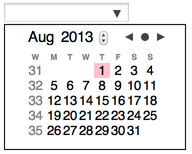

# No Dependency Datepicker

There are a huge amount of datepickers out there. I needed one with no dependencies to libraries like jQuery, and I needed week numbers, and the first week day had to be Monday. I could live with the new HTML5 input of type date, but that is not implemented everywhere, so I had to give the world yet another one datepicker.

The NoDepDatepicker is made as a polyfill widget to the input element, after it has been added to the web page.

	var inp = document.createElement('input');
	document.body.appendChild(inp);
	nodepDatepicker(inp);

Or if you have a lot of date inputs, you can get a NodeList and feed it to nodepDatepicker().

	<body>
    	<form>
      		<label> First Date: </label><input name="d1" type="date"/>
      		<label> Second Date: </label><input name="d2" type="date"/>
    	</form>
    	
	</body>

If you have a dynamic page, where elements can appear anytime, the best way to implement this polyfill is to add an evenlistener for "DOMNodeInserted", so even late inserted input elements get the datepicker code. Here is a suggestion of how to use Modernizr to decide if a datepicker polyfill is needed.

	if (! Modernizr.inputtypes.date) {
		document.addEventListener('DOMNodeInserted',
			function (evt) {
				if (evt.target instanceof HTMLInputElement && evt.target.getAttribute('type') === 'date') {
					datepicker(evt.target);
				} else if (evt.target.hasChildNodes()) {
					var inps = evt.target.querySelectorAll('input[type=date]');
					datepicker(inps);
				}
			}
		)
	}

NoDepDatepicker is prepared for use with a module loader like Require.js.

	require(['nodepdatepicker'], function (datepicker) {
		var inp = document.createElement('input');
		document.body.appendChild(inp);
		datepicker(inp);
	});

